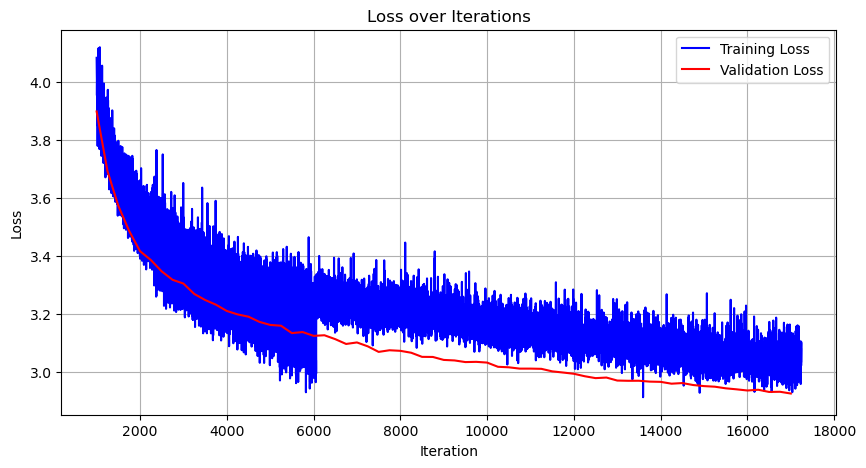

# Training GPT2 in google colab

This is a reimplementation of OpenAI's [GPT2](#https://github.com/openai/gpt-2), in which it was trained for ~17,000 iterations on the FineWeb-Edu(10BT sample) in google colab on an A100 GPU. This work take significant inspiration from Andrej Karpathy's [build nanogpt respoitory](#https://github.com/karpathy/build-nanogpt).

## Performance Metrics
Train Loss @ 17,000 iterations: 3.021
Val Loss @ 17,000 iterations: 2.925
HellaSwag Accuracy 0.302 (+ 0.006 improvement relative to OpenAI)

Access to the checkpoint for the 17,000 iteration: https://drive.google.com/file/d/12T_NxJLpdomM7IiewHqOzvv5EC2VbC4o/view?usp=sharing

